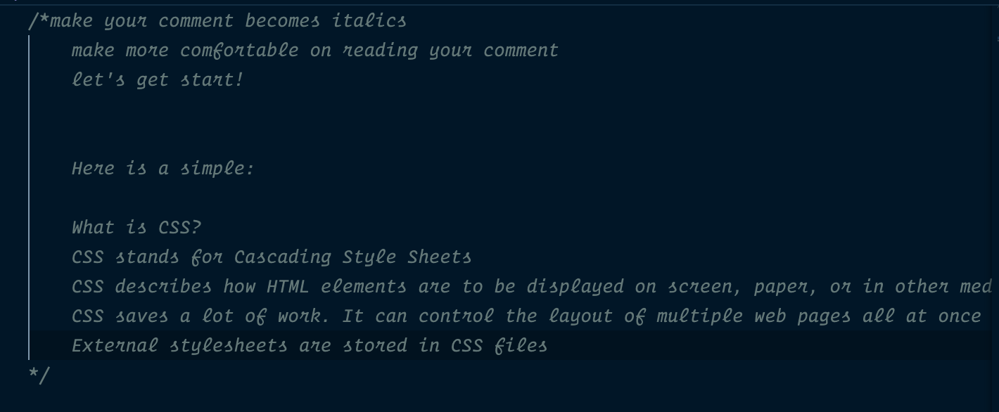
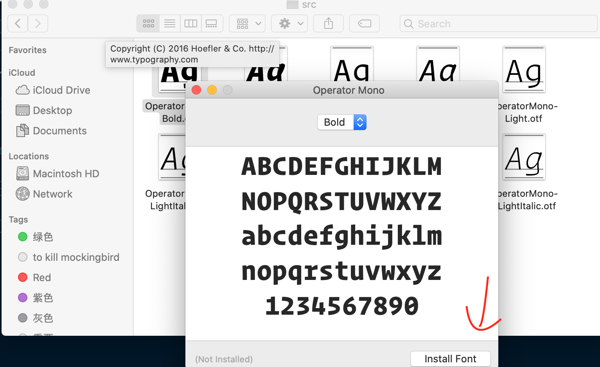
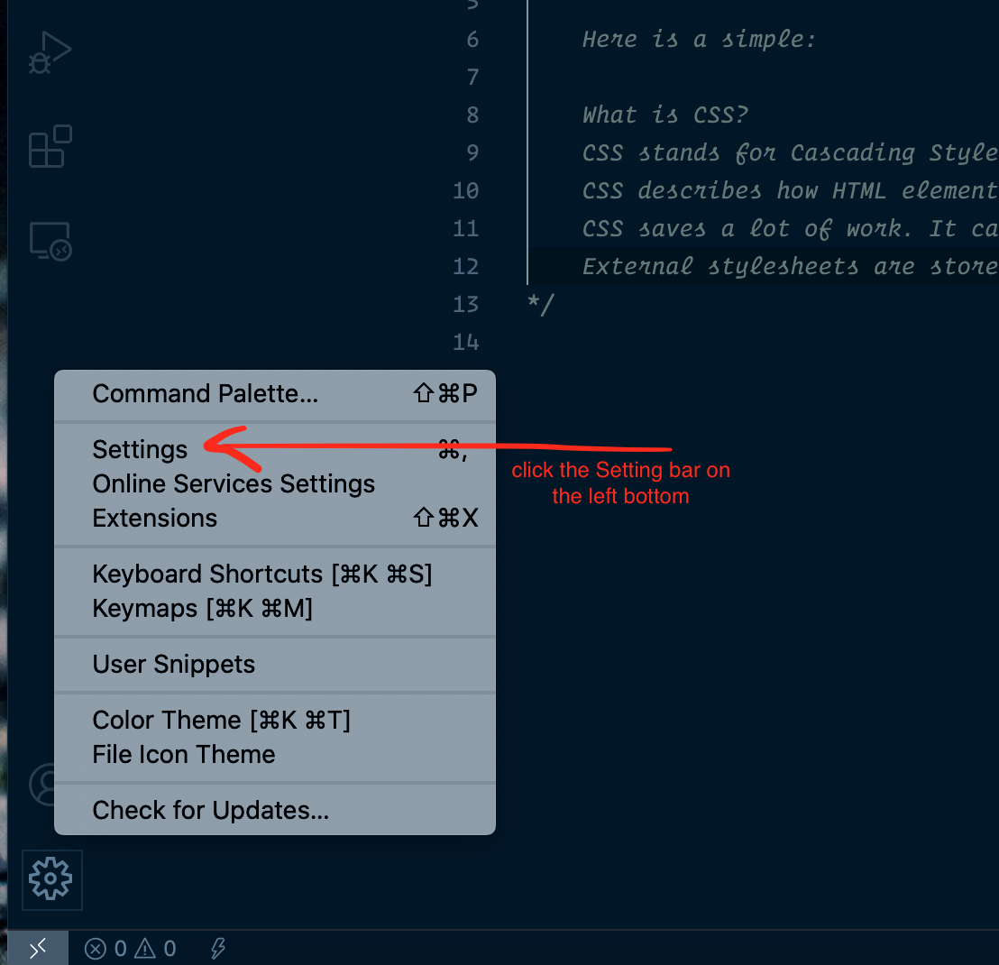
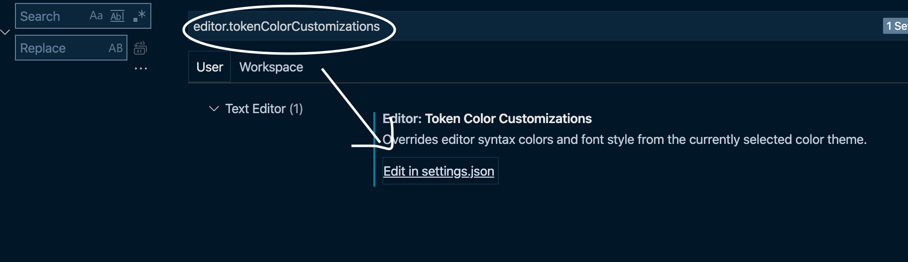

# italics font for comment in vscode 

Here is a simple how it looks like.


First step, make sure that you have Operator_mono in your Mac


Then,Directly go to the setting, and type the "ditor.tokenColorCustomizations", you will find it on the Settings.json files.



Final, directly change by following:
```
"editor.tokenColorCustomizations": {
    "textMateRules": [
      {
        "scope": [
          //following will be in italic
          "comment"
        ],
        "settings": {
          "fontStyle": "italic"
        }
      }
    ]
  }
```


